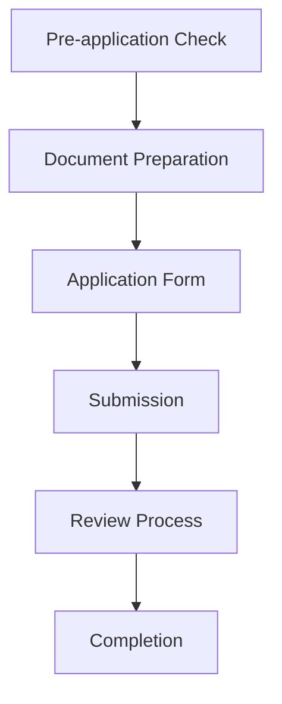

# Liquor License Application Flow

## Application Process Overview

## 1. Pre-application Check
### Checklist Items
- [ ] Business location secured
- [ ] Resident registration requirements
- [ ] Required capital verification
- [ ] Location requirements
- [ ] Disqualification factors

### System Support
- Checklist provision
- Requirements guide
- Progress saving
- Advice provision

## 2. Document Preparation Phase
### Required Documents
1. Application form
2. Certificate of residence
3. Floor plan
4. Business plan
5. Financial documents
6. Identification documents

### System Support
- Document checklist
- Document templates
- Upload and storage
- Expiration management

## 3. Application Form Creation
### Input Items
- Basic information
- Business location details
- Applicant information
- Types of liquor
- Sales method

### System Support
- Form input guide
- Input validation
- Draft saving
- Preview functionality

## 4. Application Submission
### Pre-submission Check
- Document completeness
- Content verification
- Attachment verification

### System Support
- Final checklist
- Submission guide
- Status tracking

## 5. Review Process
### Response Items
- Additional document submission
- Question responses
- On-site inspection

### System Support
- Additional request management
- Response tracking
- Reminder functionality
