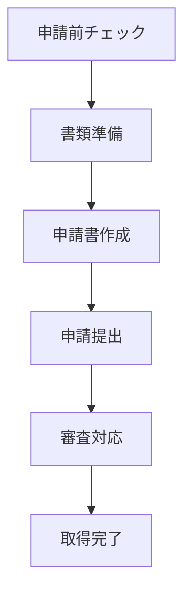

# 酒類販売業免許 申請フロー

## 申請プロセス概要

## 1. 申請前チェック
### 確認項目
- [ ] 営業所の確保状況
- [ ] 住民票要件の確認
- [ ] 必要資本金の確認
- [ ] 場所の要件確認
- [ ] 欠格事由の確認

### システムサポート
- チェックリストの提供
- 要件説明のガイド
- 準備状況の保存
- アドバイスの提供

## 2. 書類準備フェーズ
### 必要書類
1. 申請書
2. 住民票
3. 営業所の図面
4. 事業計画書
5. 財務書類
6. 本人確認書類

### システムサポート
- 書類チェックリスト
- 書類テンプレート提供
- アップロード・保管機能
- 有効期限管理

## 3. 申請書作成
### 入力項目
- 基本情報
- 営業所情報
- 申請者情報
- 酒類の種類
- 販売方法

### システムサポート
- フォーム入力ガイド
- 入力内容の検証
- 一時保存機能
- プレビュー機能

## 4. 申請提出
### 提出前確認
- 書類の完全性チェック
- 記入内容の確認
- 添付書類の確認

### システムサポート
- 最終チェックリスト
- 提出手順ガイド
- 状況追跡機能

## 5. 審査対応
### 対応事項
- 追加書類の提出
- 質問への回答
- 現地調査の対応

### システムサポート
- 追加要求の管理
- 対応状況の記録
- リマインダー機能
